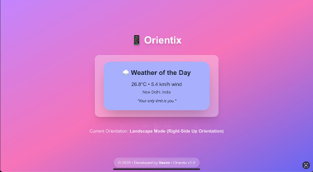

# Orientix 📱

A mobile-first web app that adapts its functionality based on device orientation.

## Features
- **Portrait (upright):** ⏰ Alarm Clock  
- **Landscape (right-side up):** ⏱ Stopwatch  
- **Portrait (upside down):** ⌛ Timer  
- **Landscape (upside down):** 🌤 Weather of the Day  

## 📸 Screenshots

### ⏰ Portrait Mode (Upright) – Alarm Clock
<p align="center">
  
  
  
</p>

---

### ⏱ Landscape Mode (Right-Side Up) – Stopwatch
<p align="center">
  
  
</p>

---

### ⌛ Portrait Mode (Upside Down) – Timer
<p align="center">
  
  
  
</p>

---

### 🌤 Landscape Mode (Upside Down) – Weather of the Day
<p align="center">
  
</p>

---

## 🎥 Demo Video
You can watch the demo here:  
[Orientix Demo](./docs/videos/orientix-demo.mp4)

## Getting Started

Follow these steps to set up and run the project locally.

### Prerequisites
- Node.js (v16 or later recommended)
- npm (comes with Node.js)

### Setup & Installation
1. **Clone the repository**  
   ```bash
   git clone https://github.com/your-username/orientix.git
   cd orientix
   ```

2. **Install dependencies**  
   ```bash
   npm install
   ```

3. **Set up environment variables**  
   Create a `.env` file in the root directory and add your weather API key:  
   ```
   VITE_WEATHER_API_KEY=your_api_key
   ```

   You can get a free API key from [OpenWeather](https://openweathermap.org/api).

4. **Run locally**  
   ```bash
   npm run dev
   ```

   The app will be available at [http://localhost:5173](http://localhost:5173).

### Build for Production
```bash
npm run build
```

### Preview Production Build
```bash
npm run preview
```

### Build for Deployment as GH Pages
```bash
rm -rf dist
npm run build
npm run deploy
```

## Deployment
You can deploy this app for free using **GitHub Pages**:
- [GitHub Pages](https://pages.github.com/)

## License
This project is privately managed.
